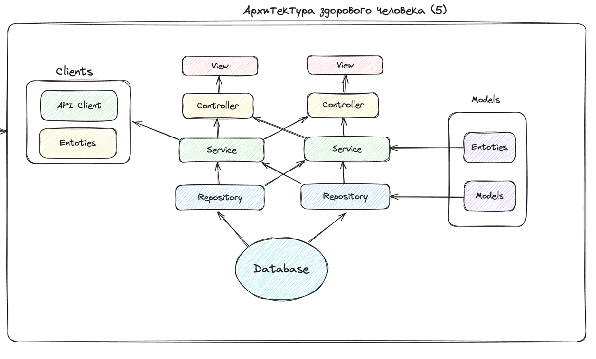

# Backend-pet

Автор: Ремша Игорь (@iremsha)

Сервис реализован в рамках учебного материала
для илюстрации взаимодействия разных слоев приложения.  


## Терминология
- Service - слой где расположена бизнес-логика приложения
- Repository - слой где организована работа с БД
- Handler/Route - слой что отвечает за взаимодействие с внешним миром через endpoints (если это REST)
- Entity - объекты описывающие сущности для использования в handler и service
- Models - объекты описывающие сущности для использования в repository и database


## Описание

На скорую руку накидал шаблон приложения на Python (FastAPI + PostgreSQL) чтобы показать реализацию
слоистой архитектуры [на YouTube](https://youtu.be/AxjsOZCNkJI). 


## Команды

Перечень команд которые могут пригодится в разработке

### Docker
```
make down - погасить контейнер
make build - собрать контейнер
make up - поднять контейнер
make run - последоватльно запустить down -> build -> up
```

### Alembic
```
source <(sed -E -n 's/[^#]+/export &/ p' .env)
alembic upgrade head
alembic revision --autogenerate -m "initial"  
```

### CLI
```
poetry run backend-pet run
```

## Идея

Подробнее можно посмотреть [на YouTube](https://youtu.be/AxjsOZCNkJI) или обратиться к `@ilremsha`

